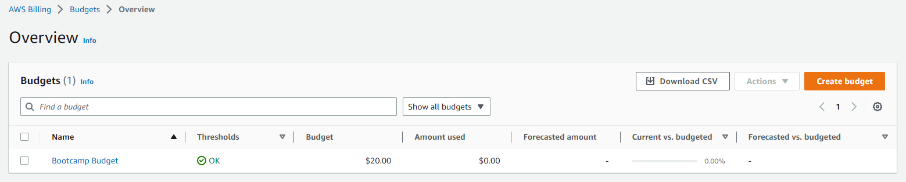
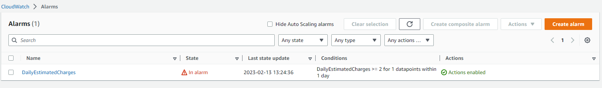
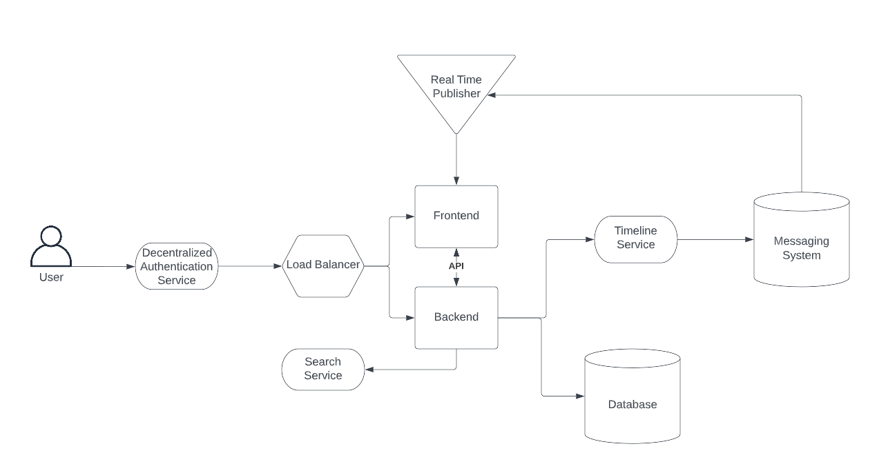
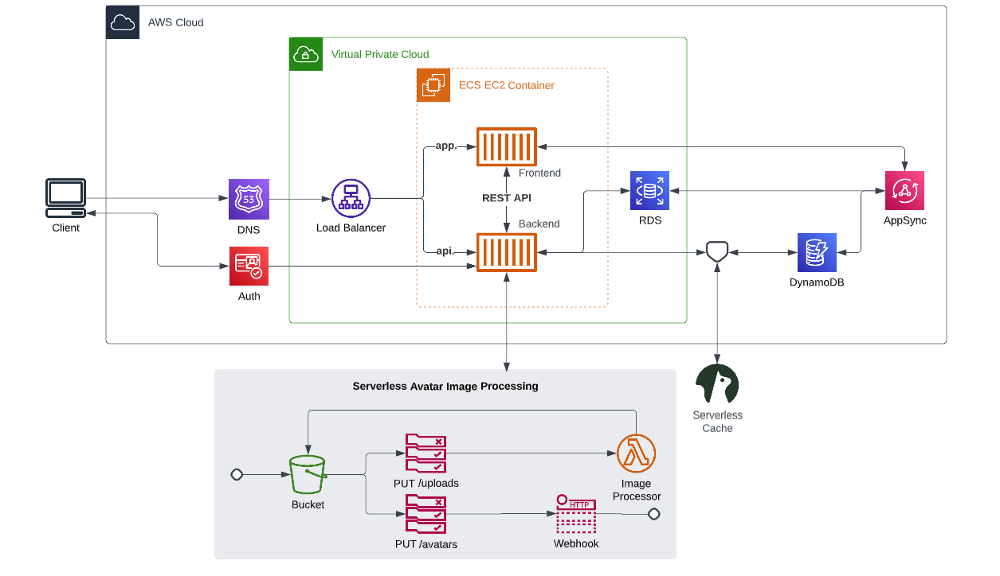

# Week 0 — Billing and Architecture

After watching all the Week 0 videos, creating all necessary accounts and setting them up in a secure and logical way I got started with the homework assignments:

- Billing
  - Creating a budget
  - Creating a billing alarm
- Architecture
  - Created a conceptual architecture diagram
  - Creating a logical architecture diagram
  - Exploring the Well-Architected Tool

## Billing

### Creating a Budget
I created a budget using the AWS CLI in gitpod. To do this I created a json object for the budget in `aws/json/budget.json` as specified in [this article](https://docs.aws.amazon.com/AWSCloudFormation/latest/UserGuide/aws-resource-budgets-budget.html). We can verify that the budget was created correctly in the AWS Console.

Next, I added a budget notification to be sent to my email when my costs reach 80% of my budget of $20. This was created in `aws/json/budget-notifs-with-subscribers.json`. We can verify that it was properly added by going to the SNS console and confirming that the correct topic and subscribers are present.

### Creating an Alarm
Similarly to above, the alarm was created using the AWS CLI in gitpod. The json can be found in `aws/json/billing-alarm.json`. The format for the json can be found on [this page](https://docs.aws.amazon.com/cli/latest/reference/cloudwatch/put-metric-alarm.html). Again we can verify that it was properly added using the console.

## Architecture

### Conceptual Diagram
I created the following conceptual diagram on a napkin. I also created it on LucidChart but had to delete it because I had exceeded the number of shapes in a single document while making my logical diagram.

### Logical Diagram
Using LucidChart, the following logical diagram was created.

